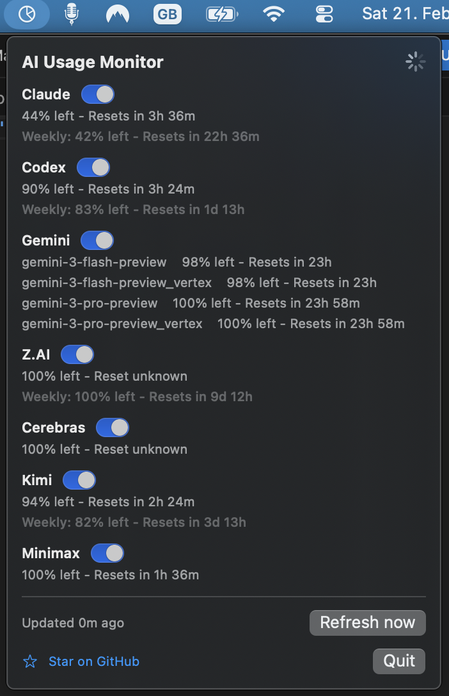
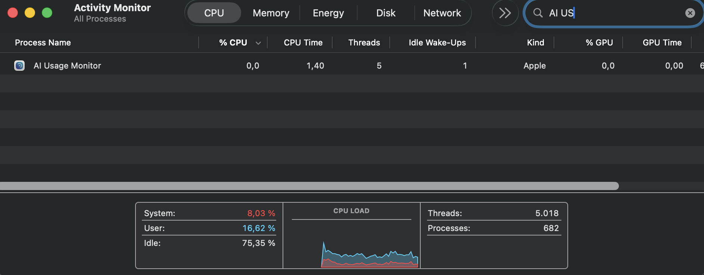

# AI Usage Monitor

A native SwiftUI macOS menu bar app that shows remaining subscription usage for your AI coding tools — Claude, Gemini, Codex, Cerebras, Kimi, Minimax, and Z.AI — all in one place.

Tiny footprint: ~27 MB RAM, refreshes every 60 seconds.



| CPU | Memory |
|-----|--------|
|  |  |

## Install

Download the latest `.dmg` from [Releases](../../releases/latest), open it, and drag **AI Usage Monitor** to Applications. No build or clone required.

> **Note:** The app is not code-signed. macOS will block it on first launch.
>
> 
>
> To allow it, go to **System Settings > Privacy & Security** and click **Open Anyway**.
>
> 

## What it does

- Runs as a `MenuBarExtra` app with a compact SwiftUI panel.
- Polls every 60 seconds.
- Uses direct provider APIs as the primary path (no interactive CLI scraping).
- Shows remaining quota %, reset timing, and provider-specific error badges.
- Reuses local auth context from `~/.codex`, and `~/.gemini` where available.
- Supports Claude auth from local Claude credential files, `CLAUDE_ACCESS_TOKEN`, or a pasted setup-token.
- Includes Z.AI provider support via a pasted API key or env keys (`ZAI_API_KEY`, `ZAI_KEY`, `ZHIPU_API_KEY`, `ZHIPUAI_API_KEY`).
- Includes Kimi Code provider support via a pasted API key, `KIMI_KEY`, `KIMI_API_KEY`, `KIMI_CODE_API_KEY`, or `ANTHROPIC_API_KEY` (when `ANTHROPIC_BASE_URL` points to `api.kimi.com/coding`).
- Includes Minimax provider support via a pasted API key.

## Build

```bash
swift build
```

## Run

```bash
swift run AIUsageMonitor
```

## Tests

```bash
swift test
```

## DMG packaging

```bash
./Scripts/build_dmg.sh
```

This produces `dist/AIUsageMonitor.dmg`.

## Notes

- Endpoints used are not all public/stable and may evolve.
- When local credentials are missing or expired, the app reports `Auth needed` or `Token expired` without launching intrusive auth flows.
- Claude reads auth from the native macOS keychain. Make sure you have already authenticated with Claude Code (`claude` in Terminal) before using this app.
- When Z.AI shows `Auth needed`, click `Set key` and paste your API key.
- Z.AI uses quota/usage monitor endpoints on `api.z.ai` to show usage when key auth is valid.
