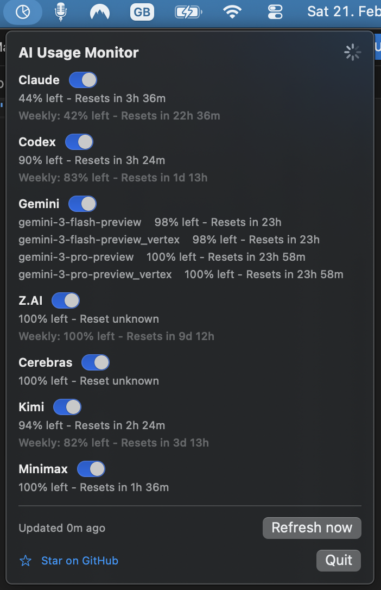
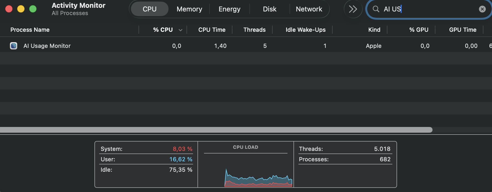
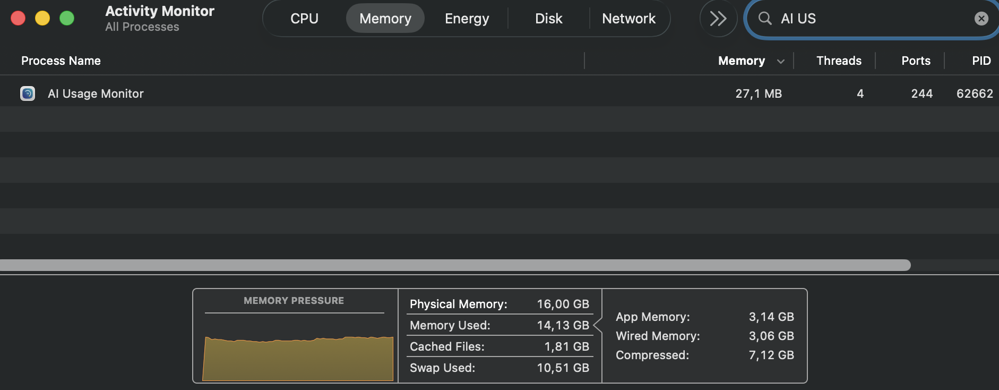
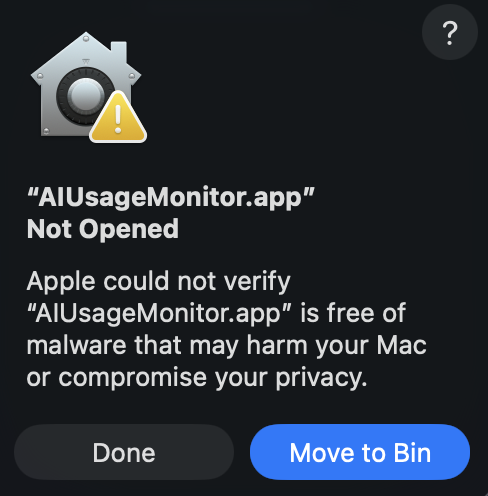
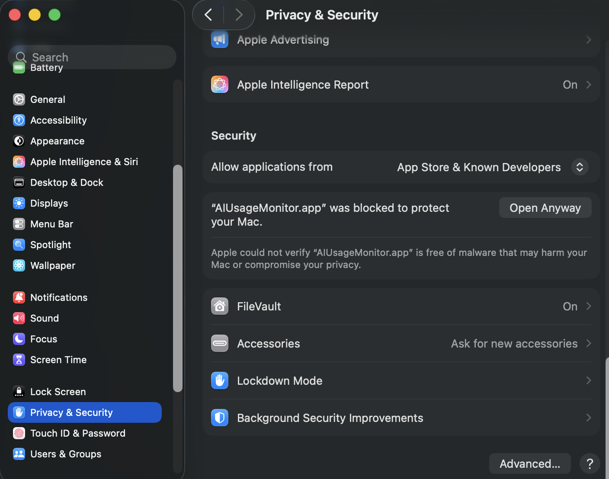

# AI Usage Monitor

A native SwiftUI macOS menu bar app that shows remaining subscription usage for your AI coding tools in one place:

- Claude
- Gemini
- Codex
- Cerebras
- Kimi
- Minimax
- Z.AI
- QwenCloud
- Cursor

Tiny footprint: ~27 MB RAM, refreshes every 5 minutes.



| CPU | Memory |
|-----|--------|
|  |  |

## Install

Download the latest `.dmg` from [Releases](../../releases/latest), open it, and drag **AI Usage Monitor** to Applications. No build or clone required.

> **Note:** The app is not code-signed. macOS will block it on first launch.
>
> 
>
> To allow it, go to **System Settings > Privacy & Security** and click **Open Anyway**.
>
> 

## What it does

- Runs as a `MenuBarExtra` app with a compact SwiftUI panel.
- Shows only activated providers in the usage panel; provider toggles, API keys, and update checks live in Settings.
- Polls every 5 minutes.
- Uses direct provider APIs as the primary path (no interactive CLI scraping).
- Shows remaining quota %, reset timing, and provider-specific error badges.
- Reuses the default OpenAI/Codex auth context from `$CODEX_HOME` or `~/.codex`, and local Gemini auth where available.
- Supports multiple named OpenAI accounts; additional browser logins are isolated in app-managed auth folders.
- Supports Claude auth from the macOS keychain, local credential files,
  `CLAUDE_CODE_OAUTH_TOKEN`, or legacy `CLAUDE_ACCESS_TOKEN`.
- Includes Z.AI provider support via a pasted API key or env keys (`ZAI_API_KEY`, `ZAI_KEY`, `ZHIPU_API_KEY`, `ZHIPUAI_API_KEY`).
- Includes Kimi Code provider support via a pasted API key, `KIMI_KEY`, `KIMI_API_KEY`, `KIMI_CODE_API_KEY`, or `ANTHROPIC_API_KEY` (when `ANTHROPIC_BASE_URL` points to `api.kimi.com/coding`).
- Includes Minimax provider support via a pasted API key.
- Includes QwenCloud Token Plan Individual API-key support via pasted `sk-sp-*` credentials, `QWEN_API_KEY`, `BAILIAN_TOKEN_PLAN_API_KEY`, or `~/.qwen/settings.json`.
- Validates QwenCloud Individual keys with the free `/models` endpoint. QwenCloud currently exposes no API-key-authenticated endpoint for its 5-hour/7-day quota values.
- Includes Cursor Individual usage by reusing the session already stored by the signed-in Cursor app. `CURSOR_SESSION_TOKEN` is available as a manual override.
- Reads Cursor's dashboard usage endpoints without making model requests or requiring an Admin API key.

## Build

```bash
swift build
```

## Run

```bash
swift run AIUsageMonitor
```

## Tests

```bash
swift test
```

## DMG packaging

```bash
./Scripts/build_dmg.sh
```

This produces `dist/AIUsageMonitor.dmg`.

## Notes

- Endpoints used are not all public/stable and may evolve.
- When local credentials are missing or expired, the app reports `Auth needed` or `Token expired` without launching intrusive auth flows.
- Claude reads auth from the native macOS keychain. Make sure you have already authenticated with Claude Code (`claude` in Terminal) before using this app.
- The first OpenAI account uses the normal Codex auth path. Add and name more OpenAI accounts in Settings, then click Login for each one.
- Additional OpenAI OAuth files live under `~/Library/Application Support/AIUsageMonitor/OpenAIAccounts/`; refresh is automatic, while invalidated credentials require an explicit Login again.
- When Z.AI shows `Auth needed`, open Settings, click `Set key`, and paste your API key.
- Z.AI uses quota/usage monitor endpoints on `api.z.ai` to show usage when key auth is valid.
- When QwenCloud shows `Auth needed`, open Settings and click `Set key` to add the subscription's `sk-sp-*` key. The app can also discover `BAILIAN_TOKEN_PLAN_API_KEY` from `~/.qwen/settings.json`.
- QwenCloud API-key validation uses only `GET /compatible-mode/v1/models` and consumes no inference credits. Since QwenCloud provides no API-key-authenticated quota endpoint, the app reports that limitation instead of making an inference request or showing fabricated quota data.
- Cursor reads `cursorAuth/accessToken` from the local read-only `state.vscdb` used by Cursor and Cursor Nightly, with Cursor Agent `auth.json` files as fallbacks. The token is never copied into app storage or logged.
- Cursor shows the monthly API pool as its primary window and Auto/Composer as its secondary window. It first calls `/api/dashboard/get-current-period-usage`, then falls back to `/api/usage-summary`.
- Cursor's dashboard endpoints are undocumented and may change. A rejected or expired session is surfaced with instructions to sign into Cursor again.
