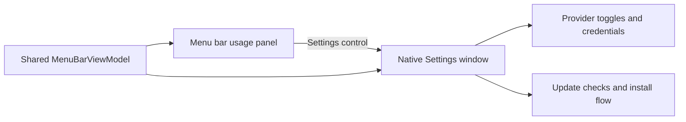

# A2 - add provider settings window
[Overview](../BASED.md)

Add a dedicated native Settings window for provider activation, credential
configuration, and update checks so setup controls no longer consume the usage
menu.

## Context

`Sources/MenuBarView.swift` currently combines quota status, provider toggles,
API-key editors, credential actions, update actions, and app controls in one
340-point-wide menu. The resulting panel can exceed the screen height and
mixes routine monitoring with infrequent configuration. `MenuBarViewModel`
already owns the provider, credential-editor, and updater state that both scenes
can share.

## Scope

- Add a SwiftUI Settings scene and a provider-focused settings view.
- Put every provider toggle and supported credential setup action in Settings.
- Put manual update checking and the existing update flow in Settings.
- Keep the existing auth persistence and update services unchanged.

## Non-goals

- Change provider APIs, authentication lookup priority, or credential storage.
- Add new providers or redesign quota presentation.
- Change update download, install, or release-server behavior.

## Acceptance Criteria

- [x] A Settings control from the menu opens a native Settings window.
- [x] Settings lists every provider with its persisted activation toggle.
- [x] Settings exposes the existing Claude authorization and API-key editors for supported providers.
- [x] Settings shows `Check Updates` when another manual check can be requested and preserves available/download/error states.
- [x] Provider and update settings use the same observable model as the menu.

## Plan

1. Extract reusable provider credential editor components from the crowded menu.
2. Build a settings view around provider activation and configuration, followed
   by an Updates section.
3. Register the Settings scene with the app and expose it from the menu.
4. Compile and test the shared state and updater visibility behavior.

Current combined menu supplied with the request:

## TODOS

- [x] Add and register the native Settings scene.
- [x] Add provider toggles and setup editors to Settings.
- [x] Move update controls and state presentation to Settings.
- [x] Expose Settings from the usage menu.
- [x] Run automated and packaging verification.

## Verification

- `swift test`
  - Result: passed — 43 tests, including native Settings and menu rendering, with 0 failures.
- `swift build`
  - Result: passed — debug build completed successfully.
- `./Scripts/build_dmg.sh`
  - Result: passed — release bundle and `dist/AIUsageMonitor-0.1.18.dmg` produced with version 0.1.18 (build 18).
- `codesign --verify --deep --strict --verbose=2 dist/AIUsageMonitor.app`
  - Result: passed — the ad-hoc signed app is valid on disk and satisfies its designated requirement.
- `hdiutil verify dist/AIUsageMonitor-0.1.18.dmg`
  - Result: passed — disk image checksum is valid; local SHA-256 is `04bf153af6ccc55a90499842e59f5bd753235e0ccedcc5ed6a33ecc079587d2d`.
- `open -n dist/AIUsageMonitor.app` followed by a 10-second process health check.
  - Result: passed — the packaged release app launched and remained running without crashing.
- `python3 scripts/validate_based.py`
  - Result: passed — `BASED validation passed.`
- SwiftUI `ImageRenderer` checks and source review of Settings navigation, provider controls, and update controls.
  - Result: passed — the 480×620 Settings content renders and the menu uses the registered native Settings scene through `SettingsLink`.

## NOTES

- This is a UI responsibility split, not a new persistence or service boundary;
  the existing observable model remains the source of truth for both scenes.

## LOGS

- 2026-08-18 — Created the task from the requested separation of monitoring and infrequent configuration; retained the supplied current-state screenshot.
- 2026-08-18 — Added a shared-model native Settings scene with all provider toggles, provider-specific credential controls, secure key editors, and updater states.
- 2026-08-18 — Rendering tests, the 43-test suite, debug/release builds, package launch smoke test, signing verification, DMG integrity, and BASED validation passed for release 0.1.18.

---
