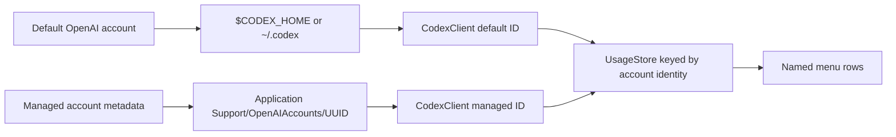

# A3 - support multiple OpenAI usage accounts
[Overview](../BASED.md)

Make OpenAI/Codex usage account-aware so one default local account and any
number of named managed accounts can be fetched, cached, enabled, and rendered
independently.

## Context

`CodexClient`, `UsageStore`, and `ProviderUsageResult` currently identify data
only by `ProviderID.codex`; all credential candidates are fallbacks for one row.
The first OpenAI account must continue using `$CODEX_HOME` or
`~/.codex/auth.json`. Additional accounts need stable identities and dedicated
app-managed auth directories without changing any other provider.

## Scope

- Add stable OpenAI account metadata with one non-removable default account and persisted named managed accounts.
- Derive managed auth directories under AI Usage Monitor's Application Support folder.
- Make provider results, stale caching, polling clients, selection, and menu rows account-aware for OpenAI only.
- Support per-account names and enabled state while preserving existing single-account behavior.
- Add focused migration, identity, dynamic-client, selection, and rendering tests.

## Non-goals

- Add multiple accounts for providers other than OpenAI.
- Copy the default Codex credentials into app-managed storage.
- Change OpenAI OAuth mechanics; task A4 owns login, refresh, and invalidation.

## Acceptance Criteria

- [x] The first OpenAI account always resolves the existing default Codex auth/config paths.
- [x] Each additional account has a stable ID, user-entered name, and auth folder managed by AI Usage Monitor.
- [x] OpenAI account names and enabled state persist across app launches.
- [x] Multiple OpenAI results coexist without overwriting each other or sharing stale cache entries.
- [x] The menu shows one independently named row per enabled OpenAI account.
- [x] Other providers retain their existing single-row behavior.

## Plan

1. Introduce precise account/client/result identity types and OpenAI account metadata persistence.
2. Extend `UsageStore` to replace OpenAI clients dynamically and key snapshots/cache by result identity.
3. Parameterize `CodexClient` by account paths and return account-tagged results.
4. Build menu rows and quota aggregation from enabled account identities.
5. Add migration and regression tests before integrating login UI in A4.

## TODOS

- [x] Add OpenAI account metadata, paths, validation, and persistence.
- [x] Add account-aware provider/result identity.
- [x] Add dynamic OpenAI clients and per-account stale caching to `UsageStore`.
- [x] Parameterize Codex usage fetching by account.
- [x] Render and aggregate enabled OpenAI accounts independently.
- [x] Add automated tests and update module documentation.

## Verification

- `swift test`
  - Result: passed — 55 tests with 0 failures, including account metadata migration, identity-aware quota selection, dynamic client pruning, named-row rendering, OAuth lifecycle, and existing providers.
- `swift build -c release`
  - Result: passed — production compilation completed successfully.
- `./Scripts/build_dmg.sh`
  - Result: passed — produced `dist/AIUsageMonitor-0.1.20.dmg` with version 0.1.20 (build 20).
- `codesign --verify --deep --strict --verbose=2 dist/AIUsageMonitor.app`
  - Result: passed — the app is valid on disk and satisfies its designated requirement.
- `hdiutil verify dist/AIUsageMonitor-0.1.20.dmg`
  - Result: passed — DMG is valid; local SHA-256 is `ade9024a2ec88eed5bba1a91f1db18e5e20499258372d44beff153bcafd925a3`.
- Packaged app 10-second launch smoke test followed by restoration of installed v0.1.19.
  - Result: passed — v0.1.20 launched and stayed running; the installed production app was relaunched afterward.
- `python3 scripts/validate_based.py`
  - Result: passed — `BASED validation passed.`

## NOTES

- The default account uses a fixed stable identity and is never removed, so existing users migrate without moving auth files.

## LOGS

- 2026-08-18 — Created the account-aware core task from the requested default-path first account and independently named additional OpenAI rows.
- 2026-08-18 — Added stable OpenAI account metadata, default/managed path ownership, account-aware result identity, dynamic clients, independent stale caches, per-account selection, and named menu rows.
- 2026-08-18 — All 55 tests, production build, v0.1.20 package, signing, DMG integrity, packaged launch, security scan, and BASED validation passed locally.
- 2026-08-18 — Published [v0.1.20](https://github.com/EzzatOmar/ai-usage-monitor/releases/tag/v0.1.20); release CI and public DMG integrity verification passed.

---
