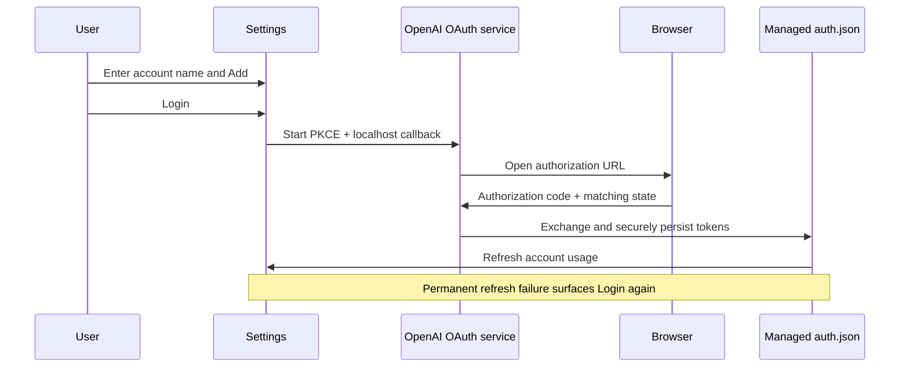

# A4 - add managed OpenAI account login
[Overview](../BASED.md)

Add Settings workflows for naming OpenAI accounts and completing browser OAuth
for app-managed accounts, including persistent token refresh and explicit
re-login after invalidation.

## Context

A3 provides account identities and managed folders. The existing `CodexClient`
can refresh an in-memory token but does not persist rotated tokens, and Settings
has no Codex login action. Official Codex browser login uses OAuth authorization
code + PKCE with a localhost callback, then stores `auth.json`; refresh rotates
tokens and permanent expiry/reuse/revocation requires a new login.

## Scope

- Add an OpenAI account editor in Settings with name input, add, enable, login/re-login, and removal controls.
- Implement browser OAuth + PKCE using the official Codex client ID and localhost callback ports.
- Store additional-account auth only in the A3 app-managed folders with restrictive file permissions.
- Persist rotated access/refresh/ID tokens atomically after refresh.
- Retry usage once after unauthorized responses and surface permanent invalidation as a login prompt.
- Support cancellation, login failure, missing credentials, and removing managed auth.

## Non-goals

- Store OpenAI account tokens in UserDefaults or logs.
- Require or automate an installed Codex CLI.
- Automatically open an interactive login during background polling.
- Add API-key editing or multiple accounts for another provider.

## Acceptance Criteria

- [x] Settings requires a non-empty user-entered name when adding an OpenAI account.
- [x] Clicking Login opens browser OAuth and writes credentials only to that account's managed folder.
- [x] The default account remains on the existing Codex path and can be reconnected without moving credentials.
- [x] Successful refresh atomically persists rotated credentials for subsequent polls and launches.
- [x] Expired, reused, revoked, mismatched, or rejected auth displays Login again without opening the browser automatically.
- [x] Removing an additional account cancels login, deletes its managed auth folder, result, and metadata.
- [x] No token, authorization code, or refresh-token content is logged or placed in task artifacts.

## Plan

1. Implement a localhost callback shell, PKCE core, browser launch, token exchange, and secure auth-file persistence.
2. Refactor Codex credential loading/refresh around explicit account paths and atomic rotation.
3. Add observable login state and account-management actions to the view model.
4. Add the OpenAI account Settings section and login/re-login states.
5. Exercise OAuth URL/callback parsing, secure persistence, rotation, invalidation, and UI rendering before packaging.

## TODOS

- [x] Add OAuth PKCE, callback, token exchange, cancellation, and secure persistence.
- [x] Persist token refresh and classify permanent invalidation.
- [x] Add account-management and login state to `MenuBarViewModel`.
- [x] Add named OpenAI accounts UI to Settings.
- [x] Add auth lifecycle and UI tests.
- [ ] Build, package, release, and verify the public artifact.

## Verification

- `swift test`
  - Result: passed — 55 tests with 0 failures. Coverage includes PKCE parameters, callback parsing and live localhost response, secure file modes, rotated-token persistence, account mismatch, permanent refresh classification, view-model login state, multiple-row rendering, and all existing providers.
- `swift build -c release`
  - Result: passed — production compilation completed successfully.
- `./Scripts/build_dmg.sh`
  - Result: passed — produced `dist/AIUsageMonitor-0.1.20.dmg` with version 0.1.20 (build 20).
- `codesign --verify --deep --strict --verbose=2 dist/AIUsageMonitor.app`
  - Result: passed — the app is valid on disk and satisfies its designated requirement.
- `hdiutil verify dist/AIUsageMonitor-0.1.20.dmg`
  - Result: passed — DMG is valid; local SHA-256 is `ade9024a2ec88eed5bba1a91f1db18e5e20499258372d44beff153bcafd925a3`.
- Credential-pattern scan across tracked source, tests, tasks, ledger, and docs.
  - Result: passed — no token-like credential content was found.
- `python3 scripts/validate_based.py`
  - Result: passed — `BASED validation passed.`
- GitHub release and public DMG verification.
  - Result: not run.

## NOTES

- OAuth callback ports 1455 and 1457 match OpenAI Codex's registered localhost redirect allow-list.
- Interactive login is user-triggered only; scheduled refreshes may refresh tokens but never launch a browser.

## LOGS

- 2026-08-18 — Created the managed-auth task after reviewing the official Codex login, file-storage, refresh-rotation, and invalidation behavior.
- 2026-08-18 — Implemented user-triggered browser OAuth + PKCE, localhost callbacks, account-isolated mode-0600 auth files, atomic refresh rotation, one retry after unauthorized usage, and explicit Login again states.
- 2026-08-18 — Added named account Settings controls and lifecycle tests; all local test, release build, packaging, signing, DMG, and security verification passed for 0.1.20.

---
