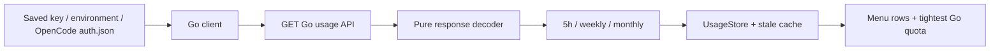

# A5 - monitor OpenCode Go subscription usage
[Overview](../BASED.md)

Research and add OpenCode Go's 5-hour, weekly, and monthly quotas, then publish the next release.

## Context

The app currently supports only primary/secondary subscription windows. OpenCode Go now exposes an API-key-authenticated read-only usage endpoint. The user authorized research, implementation when confident, and publication.

## Scope

- Research the upstream API/auth contract and record evidence.
- Add provider credentials, client, monthly window storage/rendering, and tests.
- Bump and publish the next app release using the existing workflow.

## Non-goals

- No inference requests, browser scraping, Zen balance monitoring, or account purchases.
- No changes to other providers' quota-selection semantics.

## Acceptance Criteria

- [x] Research establishes an actual read-only endpoint and response contract.
- [x] Settings supports a Go key and the client discovers existing OpenCode Go auth without modifying it.
- [x] All three quota percentages and reset timestamps render, survive stale fallback, and Go's tightest window contributes to the menu title.
- [x] Malformed responses, absent credentials, rejected keys, absent subscription, and HTTP failures have tested safe errors.
- [x] Tests and release packaging pass, and the next GitHub release has a downloadable DMG.

## Plan

1. Inspect official docs and pinned upstream source; probe only the read-only usage endpoint.
2. Add a pure decoder/credential selection core and a small HTTP/file shell.
3. Extend the result with an optional tertiary window, preserving existing provider behavior.
4. Wire settings, display, stale cache, and regression tests.
5. Verify, document, bump version, push, and verify release assets.

## TODOS

- [x] Research endpoint and source contract.
- [x] Implement credentials, transport, decoding, and domain extension.
- [x] Wire menu/settings and stale cache.
- [x] Add and run regression tests and package release.
- [x] Publish and verify release.

## Verification

- `curl -sS -D /tmp/opencode-usage-headers https://opencode.ai/zen/go/v1/usage -o /tmp/opencode-usage-public.json`
  - Passed: live HTTP 401 with `AuthError` / `Missing API key.`, matching upstream.
- Auth discovery at `$XDG_DATA_HOME/opencode/auth.json` (default `~/.local/share`), key `opencode-go`, and `OPENCODE_GO_API_KEY`.
  - No local Go key available; authenticated live account verification is not yet possible.
- Native URLSession probe using `User-Agent: AIUsageMonitor` against the same usage URL.
  - Passed: live HTTP 401 with the expected missing-key JSON. Python-only edge blocking does not affect the app transport.
- `swift test`
  - Passed: 66 tests, 0 failures, including nine Go core/client tests, three-window stale fallback/recovery, Go UI rendering, and provider/account regressions. Initial run exposed an existing hard-coded provider list expectation; updated it for the newly added provider and reran successfully.
- `bash scripts/build_dmg.sh`
  - Passed: release compilation, ad-hoc signing, and `dist/AIUsageMonitor-0.1.21.dmg` packaging (version 0.1.21, build 21).
- `python3 scripts/validate_based.py` and `git diff --check`
  - Passed before publication.
- `npm --prefix web run build`
  - Passed: static landing page includes OpenCode Go and the correct five-minute poll interval.
- `codesign --verify --deep --strict dist/AIUsageMonitor.app` and `hdiutil verify dist/AIUsageMonitor-0.1.21.dmg`
  - Passed: local bundle signature and DMG checksum verified.
- `gh run watch 35203531110 --exit-status --interval 15` and `gh run watch 35203531106 --exit-status --interval 15`
  - Passed: Release and Deploy Web Docs workflows for implementation commit `564f233`.
- `gh release view v0.1.21 --json url,tagName,isDraft,isPrerelease,assets,body` and `gh release download v0.1.21 --pattern 'AIUsageMonitor-0.1.21.dmg' --dir <temporary-directory>`
  - Passed: public non-prerelease [v0.1.21](https://github.com/EzzatOmar/ai-usage-monitor/releases/tag/v0.1.21) with uploaded 2,007,168-byte DMG. Added release notes describing setup and verification limits.
- `hdiutil verify <downloaded-DMG>`, `shasum -a 256 <downloaded-DMG>`, read-only mount/Info.plist inspection, and `codesign --verify --deep --strict <mounted-app>`
  - Passed: downloaded artifact checksum valid, version `0.1.21`, build `21`, signature valid. SHA-256 `cc3272a8b9b494766726c93b94a4665609fee3d34c3da47006ce2a8dc369b52a` matches GitHub's published digest.

## NOTES

- Architectural contract: [decision 0003](../../ledger/0003-monitor-opencode-go-three-windows.md).
- Official docs: https://opencode.ai/docs/go/ . Older issues request an endpoint, but the endpoint has since shipped; do not implement their proposed response schema.
- Pinned source revision: `88c6c7abc7f320b6aabed2634ac0b2d6e6ecea67` in https://github.com/anomalyco/opencode . Relevant files: `packages/console/app/src/routes/zen/go/v1/usage.ts`, `packages/console/core/src/subscription.ts`, `packages/opencode/src/auth/index.ts`.
- Actual response: `usage.{rolling,weekly,monthly}.{status,percent,resetsAt}`. Status is `ok` or `rate-limited`; percentages represent consumed quota. Monthly reset is subscription-anniversary based, not a fixed 30-day interval.
- HTTP 401 is an invalid/missing key; API HTTP 403 `EntitlementError` means a Go subscription is required. Do not conflate generic edge/WAF 403 with missing subscription.
- Python urllib's default signature was blocked by Cloudflare (1010), while curl reached the real route. Verify URLSession separately.

## LOGS

- 2026-09-17 — Confirmed the implemented API contract against pinned upstream source and a live unauthenticated request; began implementation after research established a viable API.
- 2026-09-17 — Implemented pure Go decoding and credential selection, a read-only HTTP/file shell, secure Settings entry, and third-window display/cache support. Recorded decision 0003.
- 2026-09-17 — All 66 tests and local release DMG packaging passed. Prepared version 0.1.21/build 21 for user-authorized publication. Live authenticated verification remains unavailable without a Go key.
- 2026-09-17 — Published v0.1.21 from `564f233`; release and website workflows succeeded. Downloaded the published DMG and verified its digest, bundle version/build, and signature. Closed A5; the user still needs to provide/connect their Go key for account-specific live usage.

---
