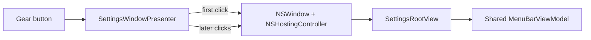

# B2 - make settings window open reliably
[Overview](../BASED.md)

Replace the unreliable SwiftUI settings-scene link with a window presentation
path that works for this menu-bar-only accessory app.

## Context

In production v0.1.18, clicking the gear visibly presses the control but no
Settings window appears. `AIUsageMonitorApp` sets the activation policy to
`.accessory` and the packaged app also has `LSUIElement=true`.
`MenuBarRootView` currently uses `SettingsLink` to open a SwiftUI `Settings`
scene. SwiftUI does not reliably activate or present that scene from a
window-style `MenuBarExtra`, especially for LSUIElement/accessory apps on macOS
26. The rendering tests only proved the settings content could render; they did
not execute window presentation.

## Scope

- Replace `SettingsLink`/`Settings` scene presentation with an explicit AppKit window shell hosting `SettingsRootView`.
- Keep the accessory activation policy and SwiftUI settings content.
- Add focused presentation tests and update UI architecture documentation.
- Record the enduring window-presentation decision in the architecture ledger.

## Non-goals

- Redesign provider settings or change provider/auth behavior.
- Add a Dock icon or turn the app into a regular windowed application.
- Change the main menu layout beyond the gear action wiring.

## Acceptance Criteria

- [ ] Clicking the gear opens a visible, key Settings window from the production menu bar app.
- [x] Repeated presentation requests reuse and bring the same Settings window to the front.
- [x] Closing and reopening Settings works without adding a Dock icon.
- [x] Settings continues to use the same `MenuBarViewModel` as the menu.
- [x] Automated tests exercise actual window creation/presentation rather than content rendering alone.

## Plan

1. Introduce a main-actor AppKit presenter that lazily creates one `NSWindow`
   with `NSHostingController(SettingsRootView)` and explicitly activates/orders
   it front.
2. Inject the presenter action into `MenuBarRootView` and remove reliance on the
   SwiftUI Settings scene.
3. Add integration coverage for opening, reuse, close, and reopen behavior.
4. Build/package the app and verify the production presentation path.

Reported production behavior:

## TODOS

- [x] Add the AppKit settings window presenter.
- [x] Wire the gear button to explicit presentation and remove the Settings scene dependency.
- [x] Add window lifecycle regression tests.
- [x] Update UI documentation and architecture ledger.
- [ ] Run build, test, package, and production verification.

## Verification

- `swift test`
  - Result: passed — 44 tests with 0 failures; the new integration test creates a visible key-capable window, verifies the hosted shared model, reuses it, closes it, and reopens it.
- `swift build -c release`
  - Result: passed — local production compilation completed successfully.
- `./Scripts/build_dmg.sh`
  - Result: passed — produced `dist/AIUsageMonitor-0.1.19.dmg` with version 0.1.19 (build 19).
- `codesign --verify --deep --strict --verbose=2 dist/AIUsageMonitor.app`
  - Result: passed — the app bundle is valid on disk and satisfies its designated requirement.
- `hdiutil verify dist/AIUsageMonitor-0.1.19.dmg`
  - Result: passed — DMG is valid; local SHA-256 is `f0309ec3eacf85bee3562f9b0cf45635eeec43f214efe549cedb6538ef28e0ea`.
- `open -n dist/AIUsageMonitor.app` followed by a 10-second process health check.
  - Result: passed — the packaged app launched and remained running without crashing.
- `python3 scripts/validate_based.py`
  - Result: passed — `BASED validation passed.`
- Packaged app gear-click, close, and reopen check.
  - Result: pending production confirmation because this harness lacks macOS Accessibility permission for menu-bar click automation.

## NOTES

- External reports and Apple forum discussions confirm `SettingsLink` does not reliably activate settings from `MenuBarExtra` accessory apps.
- A direct AppKit window avoids private selectors, timing delays, temporary Dock activation, and an additional package dependency.

## LOGS

- 2026-08-18 — Reproduced by the production report: the gear button presses but the SwiftUI Settings scene does not become visible.
- 2026-08-18 — Investigation identified the unsupported assumption: rendering `SettingsRootView` does not validate `SettingsLink` scene activation in an LSUIElement accessory app.
- 2026-08-18 — Replaced SwiftUI scene activation with a retained AppKit window hosting the same settings view/model and recorded ledger decision 0001.
- 2026-08-18 — All 44 tests, release build, package signing, DMG integrity, packaged launch smoke test, and BASED validation passed for 0.1.19; production gear-click confirmation remains pending.

---
